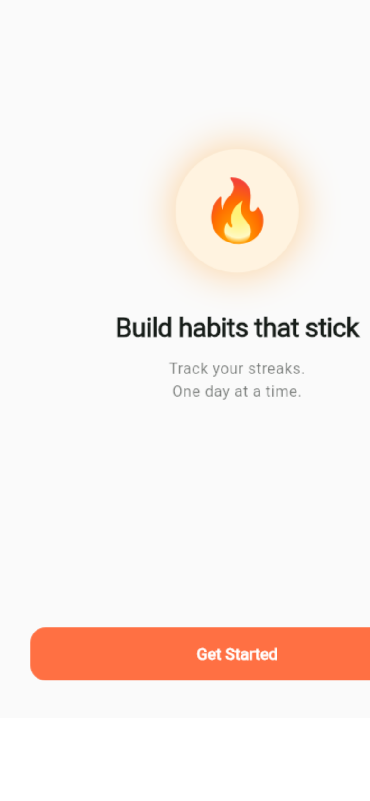
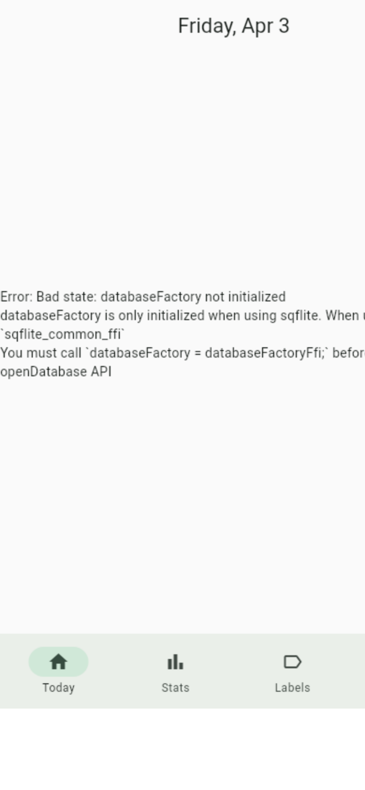

# Habit Tracker — App Screens

> **Platform**: Android (Flutter). Screenshots below were captured from the web preview build.  
> The full Android build uses SQLite for persistence; some screens render a database error in the web preview but function correctly on-device.

---

## Table of Contents

1. [Onboarding Flow](#1-onboarding-flow)
2. [Home Screen](#2-home-screen)
3. [Add / Edit Habit](#3-add--edit-habit)
4. [Habit Detail](#4-habit-detail)
5. [Check-in Flow](#5-check-in-flow)
6. [Labels](#6-labels)
7. [Stats](#7-stats)
8. [Settings](#8-settings)
9. [Navigation Structure](#9-navigation-structure)

---

## 1. Onboarding Flow

First-time users go through a 5-page guided flow. The `onboarding_complete` flag in SharedPreferences is checked on every navigation — once set, the onboarding is never shown again.

### Page 1 — Welcome



**What's shown:**
- 🔥 fire emoji in a glowing amber circle
- Headline: **"Build habits that stick"**
- Subtext: *"Track your streaks. One day at a time."*
- **"Get Started"** filled button

---

### Page 2 — Create Your First Habit

**What's shown:**
- Emoji picker button (tap to choose from 50+ curated emojis)
- Text field: *"Name your habit"* — e.g. Morning run, Read 20 minutes
- **"Continue"** button

---

### Page 3 — Set a Reminder

**What's shown:**
- Explanation of why reminders help habit formation
- Time picker button: *"Set reminder time"*
- **"Continue"** button + **"Skip for now"** text link

---

### Page 4 — How Streaks Work

**What's shown:**
- Visual explanation of the streak state machine:
  - ✅ Complete today → streak grows
  - ⚠️ Miss a day → 24-hour grace period (at-risk)
  - 🧊 Use a freeze token → streak repaired
- **"I'm ready!"** button (skippable)

---

### Page 5 — First Check-in + Celebration

**What's shown:**
- The newly created habit displayed as a card
- Tap to complete → triggers **CelebrationOverlay** (confetti + haptic)
- Streak counter animates from 0 → 1
- Automatically navigates to Home after celebration

---

## 2. Home Screen

**Route**: `/home`  
**Default layout**: Card list (switchable to Icon Grid or Progress Rings)

**App bar:**
- Title: current day — e.g. *"Friday, Apr 3"*
- Subtitle chip: *"X / Y done today"* — tapping cycles to next layout

**Body (Card List layout):**
- `HabitCard` per habit — name, icon/emoji, streak counter (🔥N), complete button
- Incomplete habits float to the top
- Completed habits show a muted checkmark state
- **EmptyStateWidget** if no habits exist yet

**All-Done State** (when every habit is completed):
- Full-screen trophy animation 🏆
- *"All habits done!"* headline
- *"Come back tomorrow to keep your streaks alive"*
- **"Add another habit"** button

**Bottom navigation bar** (4 tabs):

| Icon | Label | Route |
|------|-------|-------|
| `home` | Today | `/home` |
| `bar_chart` | Stats | `/stats` |
| `label_outline` | Labels | `/labels` |
| `settings` | Settings | `/settings` |

**FAB**: `+` → navigates to `/habit/add`

---

## 3. Add / Edit Habit

**Routes**: `/habit/add` · `/habit/:id/edit`

A scrollable form organized in section cards:

### Form sections

| Section | Controls |
|---------|----------|
| **Name** | Text field (max 50 chars, live counter) + emoji picker button |
| **Frequency** | `FrequencySelector` — Daily / Specific days / X times per week |
| **Check-in type** | `CheckInTypeSelector` — Tap only / Note / Quantity with unit |
| **Labels** | `LabelChipSelector` — multi-select chips + inline "New label" creation |
| **Reminder** | Time picker → displays chosen time; clear button |

**App bar**: *"New Habit"* (or *"Edit Habit"*) · Save button (top-right)

**On save:**
1. Validates name is non-empty
2. Persists `Habit` to SQLite via `HabitRepository`
3. Saves label assignments via `LabelRepository`
4. Schedules reminder notification if time set
5. `activeHabitsProvider` invalidated → Home refreshes

### Emoji Picker Bottom Sheet

- Grid of curated emojis (fitness, nature, productivity, etc.)
- Currently selected emoji highlighted with palette color

---

## 4. Habit Detail

**Route**: `/habit/:id`

Deep-dive view for a single habit.

**Sections:**

| Section | Content |
|---------|---------|
| **Streak summary** | Current streak 🔥, Best streak ⭐, Total completions, Completion rate % |
| **90-day heatmap** | `CalendarHeatmap` — intensity squares by week, palette color on completed days, grey on missed |
| **Day-of-week breakdown** | Bar showing completion % per weekday |
| **Insight card** | e.g. *"You've never missed a Monday"*, *"3 days from your best streak"* |
| **Check-in history** | Scrollable list of past check-ins with timestamps, notes, quantities |

**App bar actions**: Edit (pencil) → `/habit/:id/edit` · Archive (box) → confirmation dialog

---

## 5. Check-in Flow

Triggered by tapping the complete button on a `HabitCard`.

### Tap check-in (default)
1. `CheckInService.completeHabit()` called
2. Check-in recorded in `check_ins` table
3. `StreakService.onCheckIn()` updates streak
4. `LabelRepository.onHabitCheckIn()` updates all label streaks
5. At-risk notification cancelled; milestone notification sent if earned
6. Card animates to completed (muted + ✓)
7. If milestone reached → **CelebrationOverlay** fires over Home

### Note check-in
- Bottom sheet slides up with multi-line text field + **"Confirm"** button
- Note stored on the `CheckIn` record

### Quantity check-in
- Bottom sheet with numeric input + unit label (e.g. "miles")
- Value stored as `REAL` on the `CheckIn` record

### CelebrationOverlay (milestone)

Fires at **7, 14, 30, 60, 100, 365 days**:

| Milestone | Celebration tier |
|-----------|-----------------|
| 7 days | Confetti burst + haptic |
| 30 days | Larger confetti + sound + banner |
| 100 days | Full-screen animation + sound |

"New personal best" banner appears when `currentStreak == bestStreak && currentStreak > 1`.

---

## 6. Labels

**Route**: `/labels`  
**Tab**: 3rd item in bottom nav (label icon)

### Labels List Screen



**Empty state:**
- 🏷️ illustration
- *"No labels yet"* headline
- *"Group habits under labels and track a shared streak"* description
- **"Create your first label"** button

**Populated state:**
- `LabelCard` per label — emoji badge, name, member habit count
- **Streak counter** (🔥N) with best streak
- **30-day mini heatmap** — OR logic: any day a member habit was completed = filled square
- Member habit chips (icon + name)
- Amber border if streak is **at-risk** (no activity yesterday)
- Pull-to-refresh

**FAB / App bar action**: `+` → **Create Label** bottom sheet

### Create Label Bottom Sheet

- Emoji badge preview + name text field
- 6 color swatches
- 30-emoji grid picker
- **"Create Label"** filled button

### Label Detail Screen

**Route**: `/labels/:id`

| Section | Content |
|---------|---------|
| **Stats row** | Current streak, Best streak, Total active days, Completion rate % |
| **90-day heatmap** | OR-logic: any member habit done that day = filled |
| **Member Habits** | List of habits carrying this label with their icon and schedule |

**OR logic badge**: *"OR logic"* chip in the member habits section header — reminds the user that completing **any one** member habit keeps the label streak alive.

---

## 7. Stats

**Route**: `/stats`

Aggregate analytics across all habits.

**Summary cards (top row):**

| Card | Value |
|------|-------|
| Today's rate | % of habits completed today |
| Best streak | Longest active streak across all habits |
| Active habits | Count of non-archived habits |

**Insights section:**

Auto-generated natural-language cards, e.g.:
- *"You've completed Morning Run 100% on Mondays"*
- *"3 days away from your best streak"*
- *"You've never missed a Friday"*

Unlocks after 7+ days of data. Empty state shown before that.

**Habit breakdown section:**

Per-habit row showing:
- Habit name + icon
- Current streak
- 7-day sparkline (mini heatmap)
- Completion rate badge

---

## 8. Settings

**Route**: `/settings`

### Appearance
- **Theme palette** → `PalettePickerSheet` (Calm Greens / Energetic Oranges / Premium Purples)
- **Dark / Light / System** mode selector (`ThemeModeSelector` segmented button)

### Home Screen
- Layout preference: **List** / **Grid** / **Rings** (segmented button, persisted)

### Notifications
- Per-type toggles:
  - Daily habit reminder
  - Streak at-risk alert (10 pm)
  - Streak repair reminder (next morning)
  - Milestone celebration

### Streak Protection
- **Freeze tokens** balance display
- Explanation: earned at 7, 30, 60-day milestones (max 3)

### Cloud Sync
- Google Sign-In button
- Manual sync trigger
- Last sync timestamp

### About
- Version: 1.0.0+1
- Export data (coming soon)

---

## 9. Navigation Structure

```
/onboarding          ← first-time only (SharedPreferences gate)
/home                ← default after onboarding
  └── /habit/add
  └── /habit/:id
        └── /habit/:id/edit
/stats
/labels
  └── /labels/:id
/settings
```

**State management flow:**

```
DatabaseService (sqflite singleton)
  └── HabitDao / CheckInDao / StreakDao / LabelDao
        └── HabitRepository / CheckInRepository / StreakRepository / LabelRepository
              └── activeHabitsProvider (FutureProvider)
              └── allLabelsProvider (FutureProvider)
                    └── HomeScreen / LabelsScreen / StatsScreen
```

**After every check-in:**
```
CheckInService.completeHabit()
  ├── CheckInRepository.recordCheckIn()
  ├── StreakService.onCheckIn()          → updates StreakData
  ├── LabelRepository.onHabitCheckIn()  → updates LabelStreak for each label
  └── NotificationScheduler.onCheckInCompleted()
        ├── cancel at-risk notification
        └── send milestone notification (if earned)
```

---

## Theming

Three palettes, each with light + dark ThemeData:

| Palette | Primary | Streak color | Use case |
|---------|---------|--------------|----------|
| Calm Greens | `#4CAF50` | `#2E7D32` | Focus / wellness |
| Energetic Oranges | `#FF6F00` | `#E65100` | Fitness / energy |
| Premium Purples | `#7B1FA2` | `#6A1B9A` | Mindfulness / learning |

Palette and ThemeMode are persisted to SharedPreferences by `ThemeNotifier` and applied on cold start.

---

*Generated: 2026-04-03 · Flutter 3.41.6 · Dart SDK ≥3.0.0*
